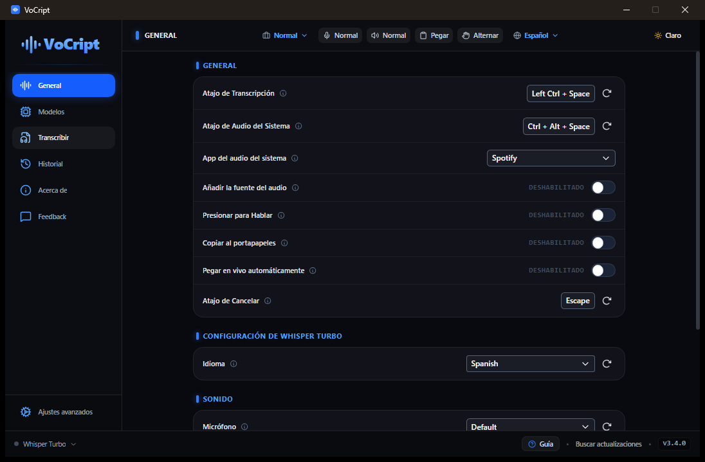
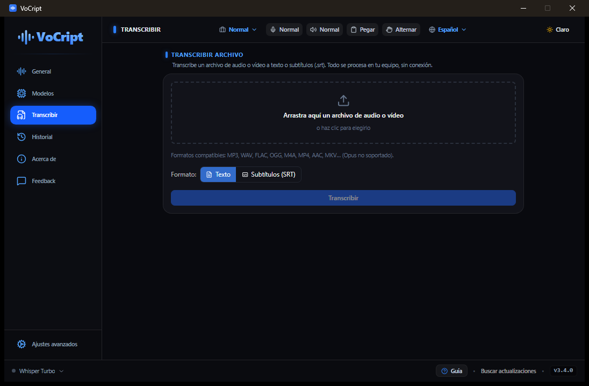
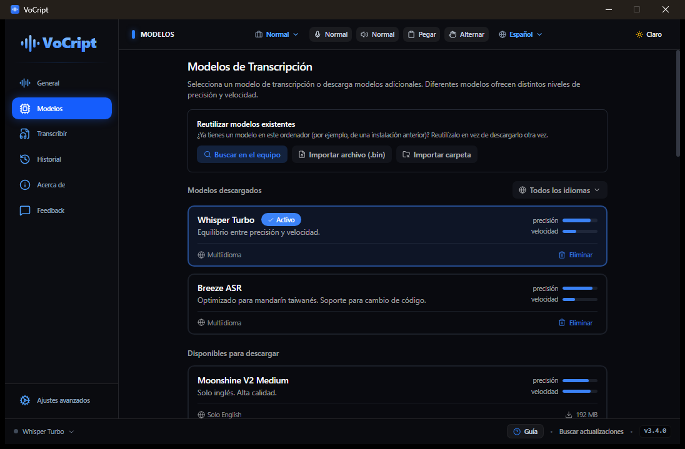
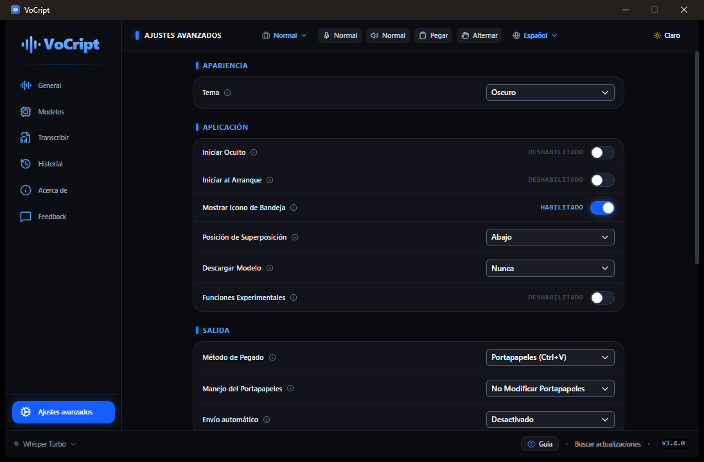

<div align="center">

# 🎙️ VoCript

**Speak and it types. Voice-to-text for Windows, 100% offline.**

🌍 [Español](README.md) · English

<p>
  <a href="https://github.com/Mun1to/Vocript/releases/latest">
    
  </a>
  <a href="LICENSE">
    
  </a>
</p>

<p align="center">
  <a href="https://github.com/Mun1to/Vocript/releases/latest">
    
  </a>
</p>

</div>

---

## ✨ What it does

VoCript turns your voice into text instantly, **right where your cursor is**.
All recognition happens **on your device** — your audio never leaves your computer.

- 🎤 **Voice dictation** — press a shortcut, speak, and the text is typed into any app.
- 🖥️ **System audio** — transcribe what's playing on your PC (a video, a call) or a specific app.
- 📁 **File transcription** — turn audio or video into text or `.srt` subtitles.
- ⚡ **Live transcription** — watch the text in a floating bubble as you speak (push-to-talk).
- 📒 **Personal dictionary** — exact replacements for names, jargon or abbreviations, with CSV import/export.
- 🕑 **History** — keeps your transcriptions and lets you replay the original audio.
- 🌐 **Multi-language** via Whisper (tuned for Spanish accents and punctuation out of the box).

---

## 📸 Screenshots

<div align="center">
  
</div>

<p align="center"><em>Main screen: the header's quick-control bar — voice/system mode, output (paste/copy), activation, profile and language. All recognition runs on your device.</em></p>

| Transcribe files | Transcription models | Advanced settings |
| :--: | :--: | :--: |
|  |  |  |

---

## ⬇️ Download

1. Go to **[the latest release (Releases)](https://github.com/Mun1to/Vocript/releases/latest)**.
2. Download the installer `VoCript_x.y.z_x64-setup.exe`.
3. Run it and follow the steps. Done!

> Windows may show an "unknown publisher" warning (the app isn't signed with a
> paid certificate yet). Click **More info → Run anyway**.

## 🔄 Automatic updates

VoCript updates **itself**: on launch it checks for a new version and, if there
is one, installs it with a single click. No manual re-downloading.

---

## ⌨️ How to use it

1. Open VoCript (it lives in the system tray, next to the clock).
2. On first run, download a transcription model (Whisper).
3. Place your cursor where you want to type, press the **dictation shortcut**, speak and release.
4. The text appears where your cursor was.

All shortcuts are configurable in **Settings → General**.

## 🔒 Privacy

VoCript runs **100% locally**. No accounts, no cloud, no telemetry: your voice
and transcriptions **never leave your computer**. Optional cloud AI
post-processing is off by default.

---

## 🛠️ For developers

VoCript is built with **Tauri 2** (Rust + React/TypeScript) and **Whisper.cpp**
with GPU acceleration (Vulkan). Source code lives in [`handy-src/`](handy-src/).

```bash
cd handy-src
bun install
bun run tauri dev      # development (hot-reload)
bun run tauri build    # production installer
```

## 📄 License & credits

VoCript is free software under the [MIT](LICENSE) license.

It is a **fork of [Handy](https://github.com/cjpais/Handy)** by
[CJ Pais](https://github.com/cjpais) (also MIT) — thanks for the great
foundation. The transcription engine is
[Whisper.cpp](https://github.com/ggerganov/whisper.cpp) by Georgi Gerganov.

Found a security issue? See the [security policy](SECURITY.md).

---

<div align="center">

🌸 Part of the **Orquio Foundation** · *Easy Tech*

<sub>Essential technology, orchestrated to be optimized, positive and transparent.</sub>

</div>
