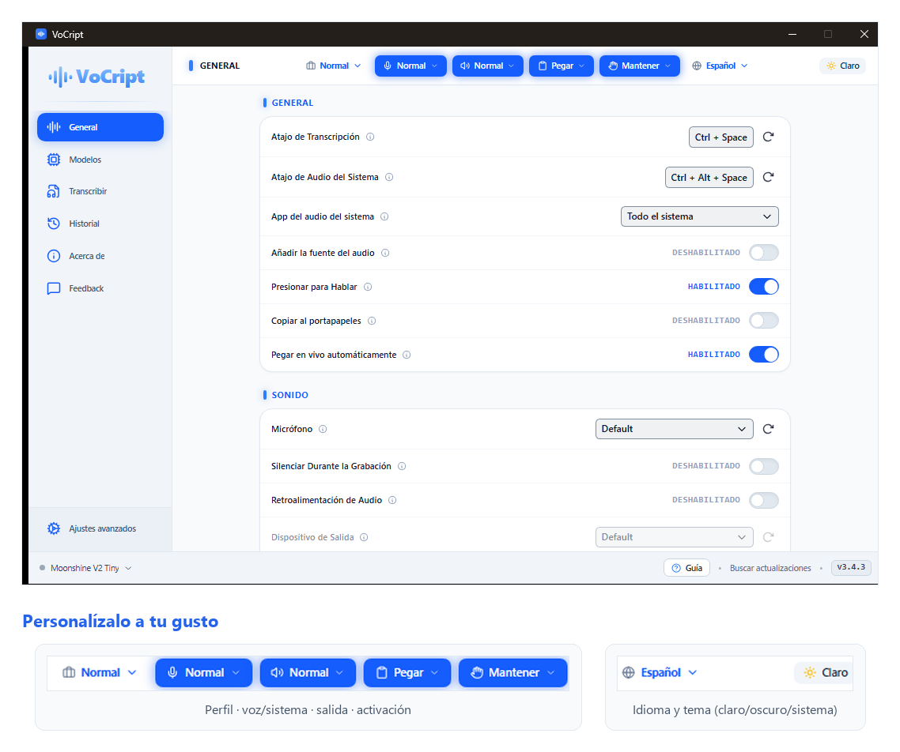

<div align="center">

# 🎙️ VoCript

**Dicta y se escribe.** Convierte tu **voz** y el **audio de tu PC** en texto, al instante y 100 % offline.

🌍 Español · [English](README.md)

<p>
  <a href="https://github.com/Mun1to/VoCript/releases/latest">
    
  </a>
  <a href="LICENSE">
    
  </a>
  <a href="SECURITY.md">
    
  </a>
</p>

<p align="center">
  <a href="https://github.com/Mun1to/VoCript/releases/latest/download/VoCript-Setup.exe">
    
  </a>
</p>

</div>

---

## ✨ Qué hace

VoCript escucha tu **voz** —o el **audio que suena en tu PC**— y lo convierte en texto **justo donde tienes el cursor**, en cualquier aplicación. Todo el reconocimiento ocurre **en tu equipo**: ni cuentas, ni nube, ni esperas.

- 🎤 **Dictado por voz** — pulsa un atajo, habla, y el texto se escribe solo en la app que estés usando.
- 🔊 **Audio del sistema** — transcribe lo que suena en el PC (un vídeo, una llamada, una reunión) o una app concreta, y opcionalmente añade de dónde viene.
- ⚡ **Transcripción en vivo** — el texto aparece palabra a palabra en una cápsula flotante mientras hablas o reproduces audio.
- 📁 **Archivos a texto o subtítulos** — arrastra un audio o vídeo y obtén texto plano o subtítulos `.srt`.
- 🎯 **Precisión a tu medida** — un **diccionario personal** de reemplazos exactos y **palabras personalizadas** que corrigen nombres o jerga por su sonido (con importar/exportar CSV).
- 💼 **Perfiles profesionales** — *Normal*, *Programación* (dicta símbolos: «arroba» → `@`, «punto y coma» → `;`) o *Personalizado* con tus propios comandos.
- 🌍 **Multi-idioma** — interfaz en 20 idiomas y transcripción en decenas, con **cambio rápido de idioma** (app y modelo a la vez). Optimizado para español (acentos y puntuación).
- 🕑 **Historial** — guarda tus transcripciones y vuelve a escuchar el audio original cuando quieras.
- 🎨 **A tu gusto** — tema claro, oscuro o **automático según tu sistema**. La primera vez detecta el **idioma y el tema de tu equipo** y te enseña lo básico con un breve tour.
- 🔒 **100 % local** — sin telemetría, con actualizaciones automáticas y firmadas.

---

## 📸 Así se ve

<div align="center">
  
</div>

<p align="center"><em>Pantalla principal: la barra de controles rápidos del header — voz/sistema, en vivo, salida (pegar/copiar), activación, perfil, idioma y tema (claro/oscuro/sistema). Todo el reconocimiento ocurre en tu equipo.</em></p>

| Transcribir archivos | Modelos de transcripción | Ajustes avanzados |
| :--: | :--: | :--: |
|  |  |  |

<br />

<div align="center">
  
</div>

<p align="center"><em>Fácil de personalizar: tema claro, oscuro o automático según tu sistema. Cambia de perfil, modo, salida, activación e idioma desde el propio header, con un clic.</em></p>

---

## ⬇️ Descargar

1. Pulsa el botón **Descargar** de arriba — o este enlace directo: **[descargar VoCript](https://github.com/Mun1to/VoCript/releases/latest/download/VoCript-Setup.exe)**. Se baja el instalador al instante.
2. Abre el archivo descargado (`VoCript-Setup.exe`).
3. Sigue los pasos. ¡Listo!

> 💡 ¿Prefieres ver todas las versiones y archivos? Están en la [página de Releases](https://github.com/Mun1to/VoCript/releases/latest).

> Windows puede mostrar un aviso de "editor desconocido" (la app aún no está
> firmada con un certificado de pago). Pulsa **Más información → Ejecutar de
> todas formas**.

## 🔄 Actualizaciones automáticas

VoCript se actualiza **solo**: al abrirlo comprueba si hay una versión nueva y,
si la hay, te la instala con un clic. No tienes que volver a descargar nada a
mano.

---

## ⌨️ Cómo se usa

1. Abre VoCript (se queda en la bandeja del sistema, junto al reloj).
2. La primera vez, elige y descarga un modelo de transcripción. Un tour te enseña lo básico.
3. **Para dictar:** coloca el cursor donde quieras escribir, pulsa el **atajo de dictado**, habla y suéltalo.
4. **Para el audio del PC:** pulsa el **atajo de audio del sistema** y VoCript transcribe lo que esté sonando.

El texto aparece donde tenías el cursor. Cambia modos y atajos desde el **header** o en **Ajustes → General**.

## 🔒 Privacidad

VoCript funciona **100 % en local**. No hay cuentas, ni nube, ni telemetría: tu
voz y tus transcripciones **no salen de tu ordenador**. El post-procesado con IA
en la nube es opcional y está desactivado por defecto.

> 🛡️ **Revisado en seguridad.** VoCript ha pasado una revisión de seguridad
> _sin vulnerabilidades críticas_: reconocimiento 100 % local, sin inyección de
> comandos, actualizaciones firmadas (minisign) y webview restringido (CSP).
> Lee el [modelo de seguridad completo](SECURITY.md).

---

## 🛠️ Para desarrolladores

VoCript está hecho con **Tauri 2** (Rust + React/TypeScript) y **Whisper.cpp**
con aceleración por GPU (Vulkan). El código fuente está en
[`vocript-src/`](vocript-src/).

```bash
cd vocript-src
bun install
bun run tauri dev      # desarrollo (hot-reload)
bun run tauri build    # instalador de producción
```

## 📄 Licencia y créditos

VoCript es software libre bajo licencia [MIT](LICENSE).

Es un **fork de [Handy](https://github.com/cjpais/Handy)**, creado por
[CJ Pais](https://github.com/cjpais) (también MIT) — gracias por el excelente
trabajo base. El motor de transcripción es
[Whisper.cpp](https://github.com/ggerganov/whisper.cpp), de Georgi Gerganov.

¿Encuentras un fallo de seguridad? Consulta la [política de seguridad](SECURITY.md).

---

<div align="center">

🌸 Parte de la **Fundación Orquio** · *Easy Tech*

<sub>Tecnología esencial orquestada de forma optimizada, positiva y transparente.</sub>

</div>
